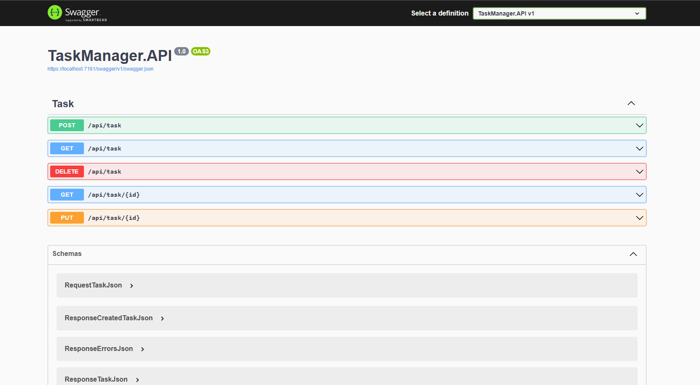

# Task Manager API

API for a Task Manager system.
The system must allow the user to create, view, edit and delete a task.

<!-- image -->

    

## Features

- [x] It must be possible to create a task;
- [x] It must be possible to view all created tasks;
- [x] It must be possible to view a task by searching for its id;
- [x] It must be possible to edit information for a task;
- [x] It must be possible to delete a task.

## What was used ?

The project was created on react

- [x] C#
- [x] .NET Core
- [x] Visual Studio versão 2022

## Meta

Author - Rockeseat.

programmer - [Fernando Futila] - fernando.futila@gmail.com

---

Done with 💜 by Fernando Futila 👋🏻
